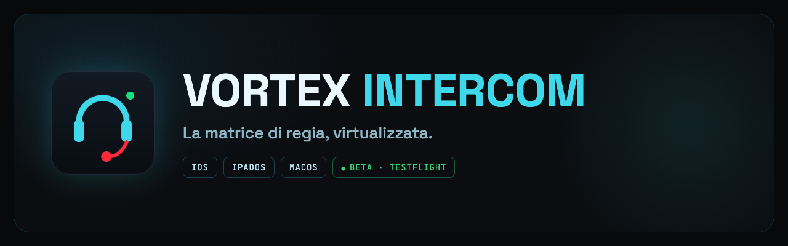
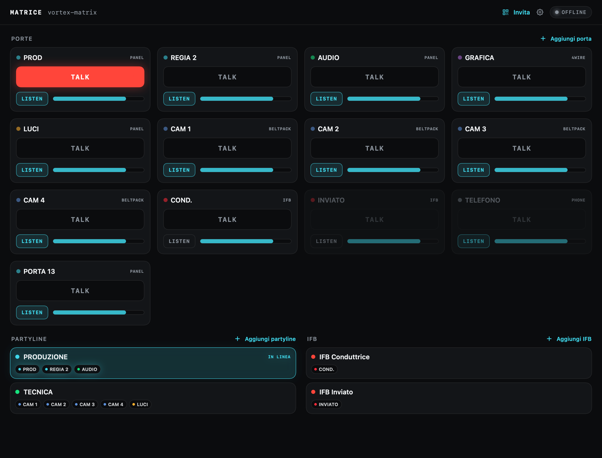
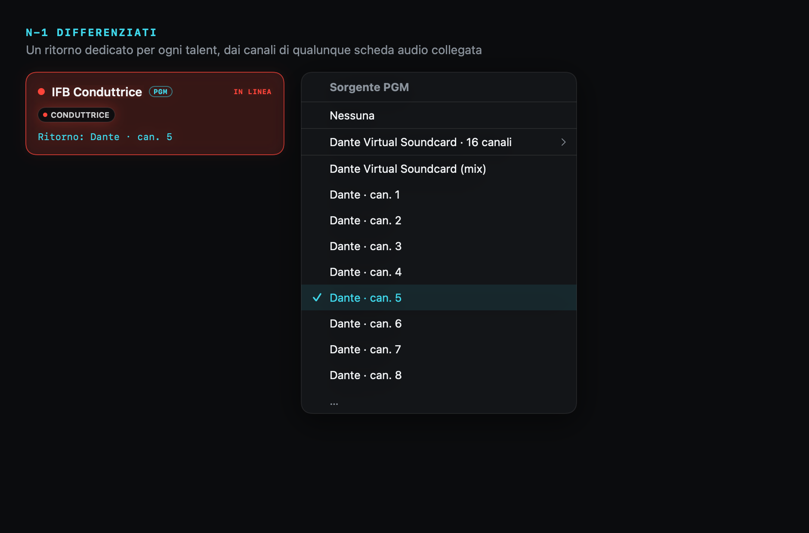
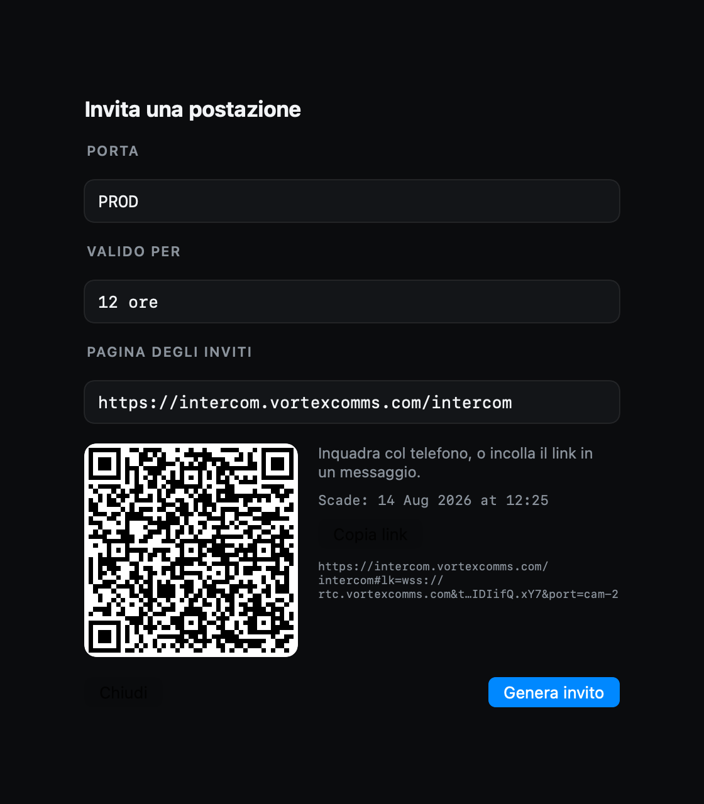
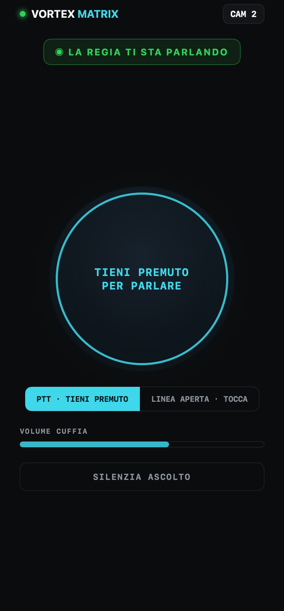
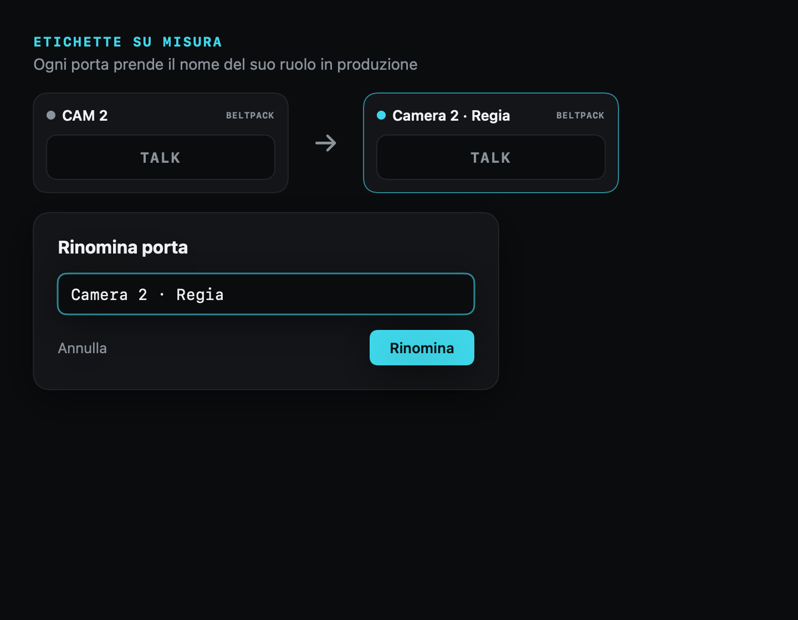

<strong>Italiano</strong> · <a href="README_EN.md">English</a>

🌐 <a href="https://solarys431.github.io/vortex-intercom/">Landing page</a>

---

## Cos'è

VORTEX Intercom è un intercom software basato sul modello delle **matrici di crosspoint** broadcast: chi parla con chi, a che volume e chi ascolta. La logica gira su LiveKit/WebRTC e non richiede una matrice intercom proprietaria dedicata. **La regia gestisce la matrice e assegna le postazioni con inviti firmati.**

---

## Funzioni principali

### Fino a 16 N-1 differenziati su interfacce compatibili
Ogni partecipante ha il proprio ritorno: il segnale program senza la sua voce. VORTEX può assegnare ogni N-1 a un canale distinto di un'interfaccia CoreAudio multicanale compatibile — per esempio una Dante Virtual Soundcard — fino a sedici circuiti indipendenti.

### La postazione è un link
La regia genera un invito firmato per un ruolo — tramite QR o link, con scadenza configurabile — e chi lo riceve apre l'intercom sul telefono. Nessun account per l'ospite. Beltpack in tasca: push-to-talk, volume in cuffia e controllo dell'ascolto.

  
  

### Su misura per la produzione
Puoi rinominare le etichette («CAM 2» → «Camera 2 · Regia»), configurare partyline per reparto e circuiti IFB e vedere chi sta parlando. Una procedura guidata collega la stanza LiveKit e condivide la configurazione con le postazioni connesse.

---

## Piattaforme

| | |
|---|---|
| **iPhone** — il beltpack | Push-to-talk in tasca per operatori, inviati e conduttori. Accesso da link; funzionamento a schermo bloccato in validazione beta. |
| **iPad** — il pannello | Un pannello della matrice a portata di dito, per regia mobile e postazioni tecniche. |
| **Mac** — la centrale | La regia gestisce la matrice e i circuiti N-1 dall'interfaccia audio, invita le postazioni e instrada le comunicazioni. |

---

## Stato

**Beta — in test su TestFlight.** Questa è la pagina di presentazione del prodotto; il codice sorgente non è pubblico.

Il sito è statico (una sola pagina): nessun cookie, nessun tracciamento, nessun dato raccolto. I font sono ospitati localmente, senza richieste a terze parti. Le immagini mostrano l'app con dati dimostrativi.

© 2026 Daniele Cappello · parte dell'ecosistema VORTEX

